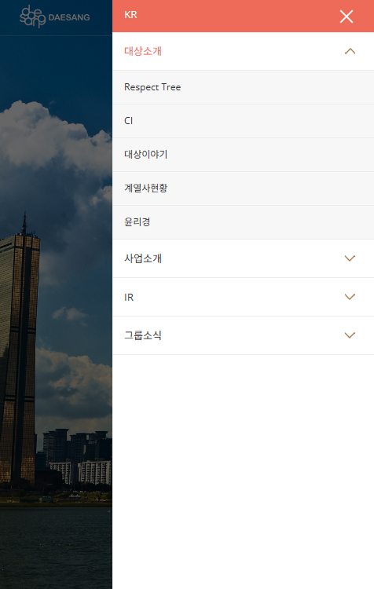

## 📂 OPEN SOURCE
 

### 🛠️ 사용 기술

| 기술 | 설명 |
|------|------|
|  | 웹 표준을 준수한 마크업 구조 |
|  | 반응형 미디어쿼리 및 전반적 스타일링 |
|  | 메뉴 동작, 슬라이더 전환, 반응형 이벤트 구현 |
|  | 슬라이더 기능 구현 및 반응형 구성 |

 

### [ open_source1 ] -📸 데모 이미지

| 데스크탑 | 모바일 |
|-------------|----------------|
|  |  |

 

### ⚙️ 기능 상세 설명

### ✅ 
