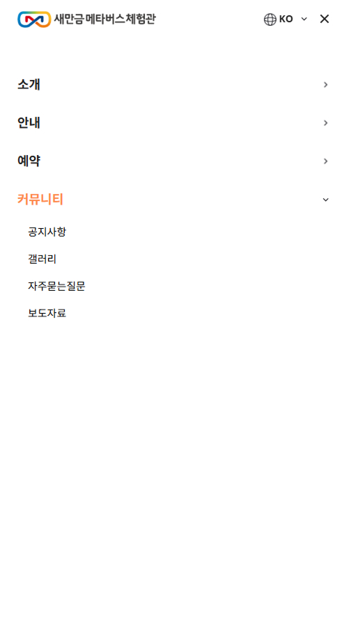
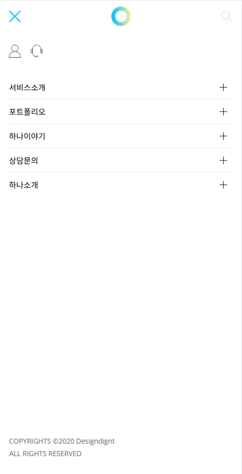
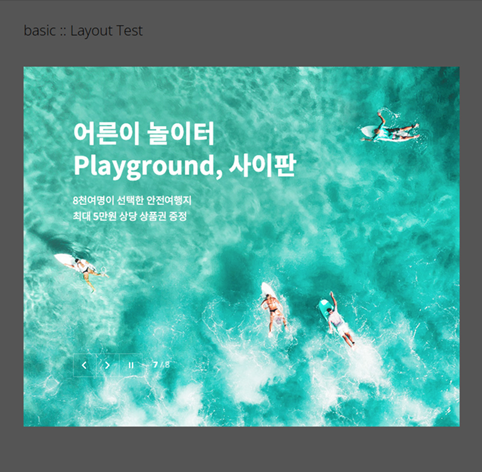

## 📂 OPEN SOURCE
 

### 💻 사용 기술

| 기술 | 설명 |
|------|------|
|  | 웹 표준을 준수한 마크업 구조 |
|  | 반응형 미디어쿼리 및 전반적 스타일링 |
|  | 메뉴 동작, 슬라이더 전환, 반응형 이벤트 구현 |
|  | 슬라이더 기능 구현 및 반응형 구성 |

 

### [ open_source1 ] -📸 데모 이미지

| 데스크탑 | 모바일 |
|-------------|----------------|
|  |  |

 

### ✨ 주요 기능

- 부드러운 메뉴 호버 동작
- 데스크탑 : 키보드 포커스 접근성 지원
- 모바일 메뉴 탭(toggle)
- 모바일 메뉴 내 아코디언 메뉴 (서브메뉴 토글)
- 스크롤 방향에 따른 헤더 숨김/노출

---

### [ open_source2 ] -📸 데모 이미지

| 데스크탑 | 모바일 |
|-------------|----------------|
|  |  |

 

### ✨ 주요 기능

- 반응형 메뉴 대응
- 데스크탑: 호버 기반 메뉴 동작
- 데스크탑: 키보드 포커스 접근성 지원
- 모바일: 햄버거 메뉴 토글
- 모바일: 서브 메뉴 아코디언
- 다국어 메뉴 드롭다운
- 스크롤 방향에 따른 헤더 숨김/노출

---

### [ open_source3 ] -📸 데모 이미지

| 데스크탑 | 모바일 |
|-------------|----------------|
|  |  |

 

### ✨ 주요 기능

- 팝업 :  쿠키 기반으로 기간별 숨김 기능 제공
- 모바일 메뉴 : 햄버거 버튼으로 열고 닫음, 서브 메뉴는 아코디언 스타일로 작동
- 사용자 편의성과 접근성을 고려한 인터랙션 중심 UI 제어

---

### [ open_source4 ] -📸 데모 이미지

| 데스크탑 |
|-------------|
|  ||

 

### ✨ 주요 기능

- Swiper를 활용한 메인 비주얼 배너 자동 슬라이드
- 슬라이드 순번 표시 기능 포함 (현재 / 총 슬라이드 수)
- 좌우 이동 버튼 및 재생/일시정지 버튼을 통한 사용자 제어 가능

---

### [ open_source5 ] -📸 데모 이미지

| 데스크탑 | 모바일 |
|-------------|----------------|
|  |  |

 

### ✨ 주요 기능

- 반응형 Swiper: 작은 화면 (< 767px)에서는 슬라이더를 활성화하고, 큰 화면에서는 슬라이더를 비활성화
- 슬라이드 수 설정: 작은 화면에서 슬라이드가 1.5개씩 보이도록 설정
- 리사이즈 처리: 화면 크기에 맞춰 슬라이더 초기화 및 파괴

---

### [ open_source5 ] -📸 데모 이미지

| 데스크탑 |
|-------------|
|  ||

 

### ✨ 주요 기능

- 메인 Swiper 슬라이더: 슬라이드 전환을 자동으로 처리하며, 슬라이드 변경 시 5초의 자동 재생 딜레이 설정
- 프로그레스 바 애니메이션: 슬라이드 전환에 맞춰 진행 상태를 나타내는 바가 0%에서 100%로 채워짐
- 이전/다음 버튼: 슬라이드를 직접 탐색할 수 있는 버튼 제공
